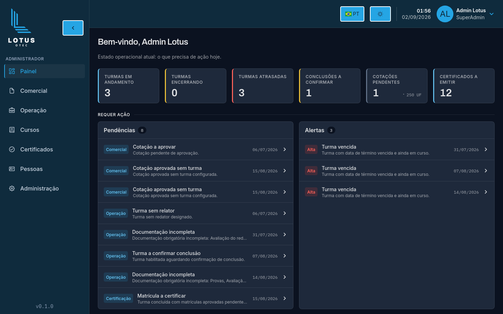
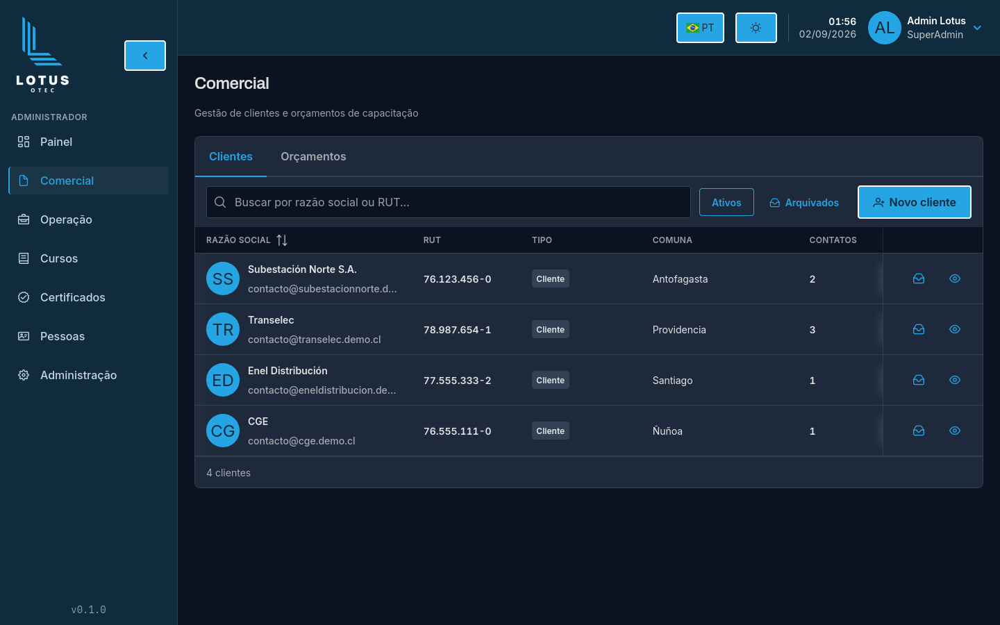
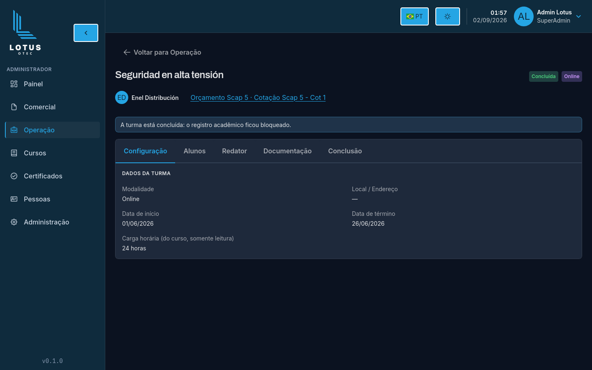
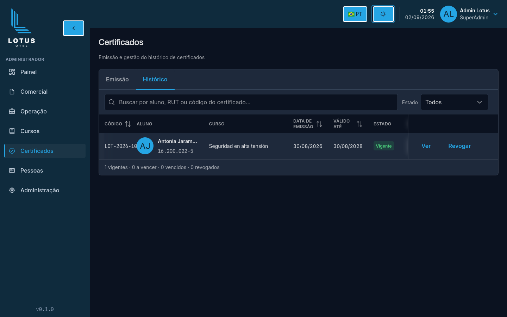

<p align="center">
  <picture>
    <source media="(prefers-color-scheme: dark)" srcset="frontend/src/assets/LogoDark.png">
    
  </picture>
</p>

<h1 align="center">Lotus</h1>

<p align="center">
  Plataforma corporativa para gerenciar, de ponta a ponta, o ciclo de capacitação profissional.
</p>

<p align="center">
  
  
  
  
  
  
</p>



## Sobre o projeto

O **Lotus** centraliza o fluxo operacional de uma OTEC: clientes e orçamentos,
cursos, turmas, matrículas, resultados e emissão de certificados verificáveis
por QR Code. A plataforma foi desenhada para um contexto regulado, no qual
rastreabilidade, controle de acesso e consistência documental são requisitos do
produto.

A interface atende administradores e redatores, oferece português, espanhol e
inglês, possui temas claro e escuro e adapta a navegação às permissões de cada
perfil.

## Principais recursos

- **Painel operacional** com indicadores, pendências e alertas priorizados.
- **Gestão comercial** de clientes, contatos, endereços, orçamentos e cotações.
- **Operação de turmas** com redatores, alunos, documentos, resultados e conclusão.
- **Catálogo de cursos** com modelos de certificado e habilitação de redatores.
- **Certificação** individual ou em lote, histórico, PDF, revogação e validação pública.
- **Pessoas e acesso** com alunos, equipe, perfis, permissões e trilha de auditoria.

## Interface

As imagens abaixo foram capturadas com Playwright em um ambiente local com
dados demonstrativos, viewport de 1440 × 900, idioma pt-BR e tema escuro.

<table>
  <tr>
    <td width="50%" valign="top">
      
      <br>
      <sub><strong>Comercial</strong> — clientes e orçamentos em uma visão unificada.</sub>
    </td>
    <td width="50%" valign="top">
      
      <br>
      <sub><strong>Operação</strong> — configuração e acompanhamento do ciclo acadêmico.</sub>
    </td>
  </tr>
  <tr>
    <td colspan="2" valign="top">
      
      <br>
      <sub><strong>Certificados</strong> — emissão, consulta, vigência e revogação.</sub>
    </td>
  </tr>
</table>

## Arquitetura

O projeto é um monólito modular com separação explícita entre aplicação web,
API e serviços de infraestrutura:

| Camada | Responsabilidade |
| --- | --- |
| `frontend/src/app` | Composição da SPA, rotas, providers e layouts |
| `frontend/src/features` | Funcionalidades organizadas por domínio |
| `frontend/src/shared` | UI reutilizável, cliente HTTP, estado e tipos compartilhados |
| `backend/app/Domains` | Casos de uso, regras e endpoints organizados por domínio |
| `backend/app/Shared` | Serviços transversais, erros, arquivos, paginação e auditoria |
| `backend/database` | Migrations, factories e dados demonstrativos |

Decisões centrais da solução:

- backend em **DDD-lite**, sem uma camada de repository sobre o Eloquent;
- frontend em três camadas, com componentes PrimeReact encapsulados em `shared/ui`;
- tipos TypeScript gerados a partir dos DTOs do backend;
- autenticação de SPA por cookie com Laravel Sanctum e proteção CSRF;
- autorização por papéis e permissões, com a API como fronteira de segurança;
- erros de API no formato RFC 7807 e auditoria das operações relevantes.

## Tecnologias

| Área | Tecnologias |
| --- | --- |
| Frontend | React 19, TypeScript 6, Vite 8, TanStack Query, Zustand, PrimeReact e Tailwind CSS |
| Backend | PHP 8.3, Laravel 13, Sanctum, Spatie Laravel Data e Spatie Permission |
| Dados | MySQL 8, S3/MinIO e auditoria persistida |
| Documentos | Gotenberg, QR Code e geração de certificados em PDF |
| Desenvolvimento | Docker Compose, Mailpit, ClamAV, Vitest, PHPUnit e ESLint |
| Entrega | GitHub Actions e imagens Docker versionadas por SHA |

## Executando localmente

### Pré-requisitos

- Git;
- Docker com Docker Compose v2;
- Node.js 22;
- Corepack habilitado para usar o pnpm definido pelo projeto.

### 1. Clone e prepare o ambiente

```bash
git clone https://github.com/Andred21/lotus.git
cd lotus

cp .env.example .env
cp backend/.env.example backend/.env
cp frontend/.env.example frontend/.env
```

### 2. Suba a API e os serviços de apoio

```bash
docker compose build app
docker compose run --rm --no-deps app composer install
docker compose up -d

docker compose exec -T app php artisan key:generate
docker compose exec -T app php artisan migrate --seed
```

### 3. Inicie o frontend

```bash
cd frontend
corepack enable
pnpm install --frozen-lockfile
pnpm dev
```

Com as portas padrão, os serviços ficam disponíveis em:

| Serviço | URL |
| --- | --- |
| Aplicação web | <http://localhost:5173> |
| API | <http://localhost:8080> |
| Mailpit | <http://localhost:8025> |
| MinIO Console | <http://localhost:9001> |

Para executar mais de uma worktree simultaneamente, altere as portas
`LOTUS_DEV_*` no arquivo `.env` da raiz.

<details>
  <summary><strong>Acesso ao ambiente demonstrativo local</strong></summary>

  O seeder cria esta conta somente nos ambientes `local` e `demo`:

  - E-mail: `admin@lotus.cl`
  - Senha: `senha123`

  Fora desses ambientes, nenhuma conta administrativa com senha conhecida é
  criada.
</details>

## Testes e qualidade

Backend:

```bash
docker compose exec -T app php artisan test
```

Frontend:

```bash
cd frontend
pnpm lint
pnpm test
pnpm build
```

A integração contínua executa testes de backend e frontend, lint, build,
verificação de drift dos tipos gerados e auditorias de dependências. Imagens de
produção são publicadas somente para commits da `main` que passam por esses
gates.

## Estrutura do repositório

```text
lotus/
├── backend/          # API Laravel e domínios da aplicação
├── frontend/         # SPA React e biblioteca de interface
├── docker/           # Imagens e configuração do ambiente
├── docs/             # ADRs, especificações e registros técnicos
├── scripts/          # Automação de entrega e verificação
└── docker-compose.yml
```

## Status

O Lotus está em desenvolvimento ativo. As capturas deste README representam o
ambiente demonstrativo local e não contêm dados de produção.
